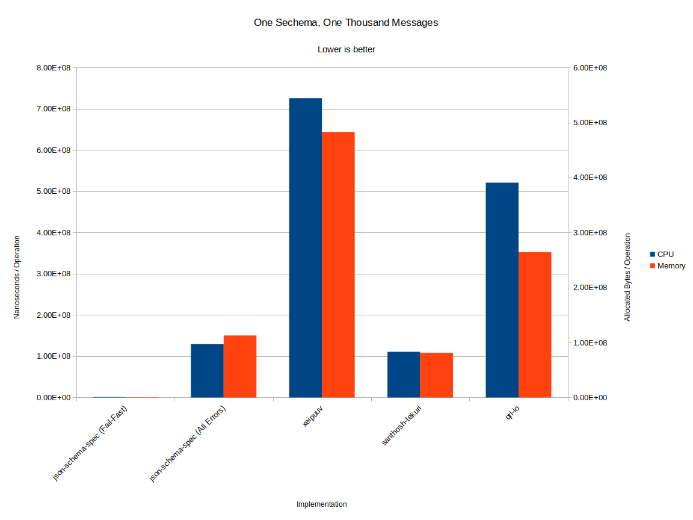
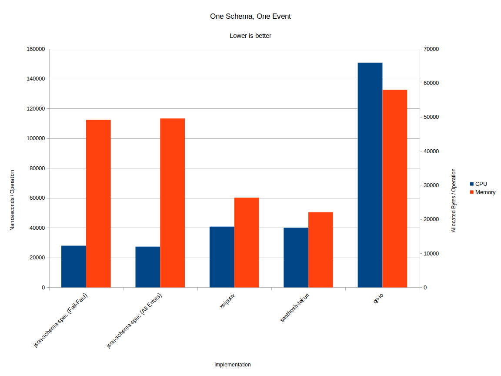

# json-schema-go-benchmark

This package contains benchmarks of the following Golang JSON Schema validator
implementations:

* github.com/json-schema-spec/json-schema-go
* github.com/qri-io/jsonschema
* github.com/santhosh-tekuri/jsonschema
* github.com/xeipuuv/gojsonschema

## Findings

Overall, from these benchmarks it would seem that the following are true, if CPU
and memory performance are your greatest concerns:

* If you are using the same schema against many events, and just finding the
  first error is enough, use [`json-schema-spec/json-schema-go`][impl1].
* If you are using the same schema against many events, but you need to find
  *all* errors, use either [`json-schema-spec/json-schema-go`][impl1] or
  [`santhosh-tekuri/jsonschema`][impl3].
* If you are using schemas only to validate a single message, then there is a
  tradeoff to be made:

  * If speed is the highest concern, use
    [`json-schema-spec/json-schema-go`][impl1]. It's 30% faster than the
    next-fastest option, but at the cost of twice the memory usage.
  * [`santhosh-tekuri/jsonschema`][impl3] and [`xeipuuv/gojsonschema`][impl2]
    are next-fastest. They're both about 30% slower, but 50% more
    memory-efficient.

JSON Schema is extremely difficult to benchmark reliably. The best benchmark is
the one you inform from your use-case.

[impl1]: github.com/json-schema-spec/json-schema-go
[impl2]: github.com/xeipuuv/gojsonschema
[impl3]: github.com/santhosh-tekuri/jsonschema

### Graphical Form





### Raw

In raw form, the results are:

```
> go test -benchmem -bench=.
goos: linux
goarch: amd64
pkg: github.com/ucarion/json-schema-go-benchmark
BenchmarkIsValid/impl1-one/realistic_1-8         	   50000	     27977 ns/op	   49163 B/op	      95 allocs/op
BenchmarkIsValid/impl1-all/realistic_1-8         	   50000	     27359 ns/op	   49561 B/op	      98 allocs/op
BenchmarkIsValid/impl2/realistic_1-8             	   30000	     40780 ns/op	   26328 B/op	     405 allocs/op
BenchmarkIsValid/impl3/realistic_1-8             	   50000	     40087 ns/op	   22056 B/op	     229 allocs/op
BenchmarkIsValid/impl4/realistic_1-8             	   10000	    150750 ns/op	   57958 B/op	     672 allocs/op
BenchmarkIsValid/impl1-one/realistic_10-8        	   50000	     39940 ns/op	   53593 B/op	     152 allocs/op
BenchmarkIsValid/impl1-all/realistic_10-8        	    1000	   2403292 ns/op	 1987946 B/op	    8316 allocs/op
BenchmarkIsValid/impl2/realistic_10-8            	     100	  12735779 ns/op	 8388747 B/op	  176015 allocs/op
BenchmarkIsValid/impl3/realistic_10-8            	    1000	   2067638 ns/op	 1451997 B/op	   27213 allocs/op
BenchmarkIsValid/impl4/realistic_10-8            	     200	   9502602 ns/op	 4756102 B/op	  130137 allocs/op
BenchmarkIsValid/impl1-one/realistic_100-8       	   10000	    125436 ns/op	   97175 B/op	     701 allocs/op
BenchmarkIsValid/impl1-all/realistic_100-8       	     100	  14066897 ns/op	12066825 B/op	   49390 allocs/op
BenchmarkIsValid/impl2/realistic_100-8           	      20	  78720792 ns/op	51027134 B/op	 1070386 allocs/op
BenchmarkIsValid/impl3/realistic_100-8           	     100	  12323072 ns/op	 8627708 B/op	  162447 allocs/op
BenchmarkIsValid/impl4/realistic_100-8           	      30	  57009060 ns/op	28033546 B/op	  773057 allocs/op
BenchmarkIsValid/impl1-one/realistic_1000-8      	    2000	    996877 ns/op	  537550 B/op	    6245 allocs/op
BenchmarkIsValid/impl1-all/realistic_1000-8      	      10	 129423684 ns/op	112748585 B/op	  464105 allocs/op
BenchmarkIsValid/impl2/realistic_1000-8          	       2	 725570021 ns/op	482803128 B/op	10137560 allocs/op
BenchmarkIsValid/impl3/realistic_1000-8          	      10	 110716420 ns/op	81184133 B/op	 1534906 allocs/op
BenchmarkIsValid/impl4/realistic_1000-8          	       2	 520807439 ns/op	264197984 B/op	 7296882 allocs/op
PASS
ok  	github.com/ucarion/json-schema-go-benchmark	63.950s
```

## Methodoloy

Most benchmarks focus on the [JSON Schema Test Suite][test-suite]. This is
problematic because real JSON schemas don't look like those test cases. Also,
many use-cases involve using the same schema against hundreds of instances, a
common usage pattern that the test suite does not help with.

Instead, this package tests instances against this schema:

```json
{
  "type": "object",
  "required": ["event", "userId", "properties"],
  "properties": {
    "event": {
      "type": "string"
    },
    "userId": {
      "type": "string"
    },
    "properties": {
      "type": "object",
      "required": ["products", "coupon", "total"],
      "properties": {
        "products": {
          "type": "array",
          "items": {
            "type": "object",
            "required": ["id", "variant", "quantity", "price"],
            "properties": {
              "id": {
                "type": "string"
              },
              "variant": {
                "type": "string"
              },
              "quantity": {
                "type": "integer"
              },
              "price": {
                "type": "number"
              }
            }
          }
        },
        "coupon": {
          "type": "string"
        },
        "total": {
          "type": "number"
        }
      }
    }
  }
}
```

Messages are randomly generated against this schema, such that many different
failure conditions of this schema are tested.

[test-suite]: https://github.com/json-schema-org/JSON-Schema-Test-Suite
